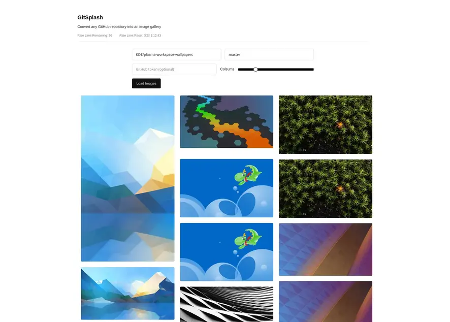

# GitSplash: Convert any GitHub repository to an image gallery



## Running

You need to have Deno v2.0.0 or later installed to run this repo.

Start a dev server:

```sh
$ deno task dev
```

## Deploy

Build production assets:

```
$ deno task build
```
